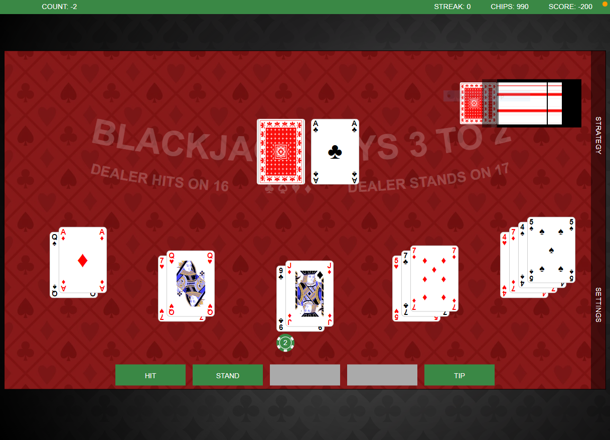
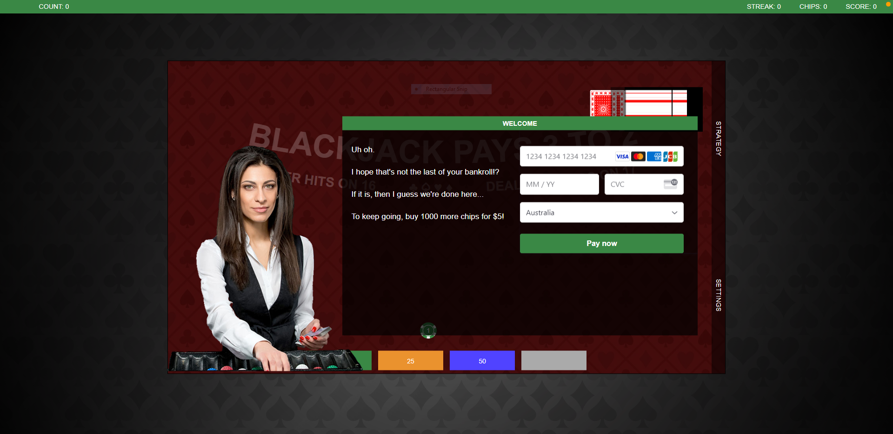
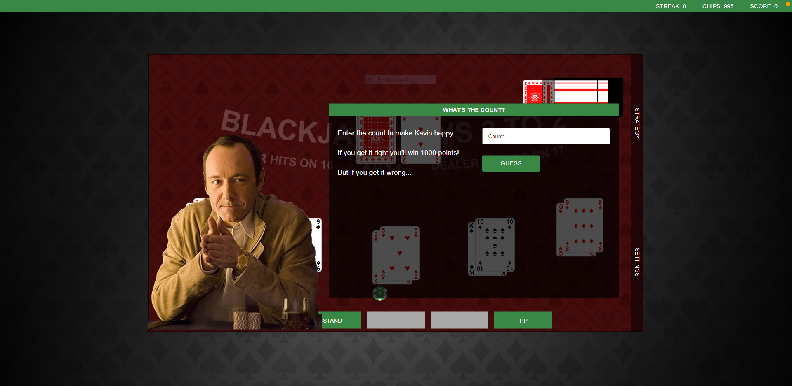

# Black Jack Advantage Play Trainer

## CONTENTS

[1. DESCRIPTION](#DESCRIPTION)

[2. SCREENSHOTS](#SCREENSHOTS)

[3. INSTALLATION](#INSTALLATION)

[4. USAGE](#USAGE)

[5. TECHNOLOGIES USED](#TECHNOLOGIESUSED)

[6. CONTRIBUTE](#CONTRIBUTE)

[7. TESTS](#TESTS)

[8. LICENCE](#LICENCE)

[9. LINKS](#LINKS)

## DESCRIPTION

Practice your card counting and basic strategy skills with this training app.

## SCREENSHOTS

"

"

"

## INSTALLATION

    In your projects folder, run the following commands:
        git clone https://github.com/vesnathan/blackjack-card-counting-trainer
        cd blackjack-card-counting-trainer

    Run "yarn" in the following directories:
       root
       client
       backend

## USAGE

    Run the following command from the root:
        "yarn dev"

## TECHNOLOGIES USED

React  
TypeScript  
Sass - SCSS  
Apollo/GraphQL  
MaterialUI  
Styled Components  
ESLint - Air BnB  
Husky  
bcrypt  
JSON Web Token  
PWA  
Stripe Elements

## CONTRIBUTE

    No contributions accepted

## TESTS

    No tests created

## LICENCE

    This software is copyright and is not to be used in
    any way shape or form unless written authorisation is
    obtained from it's developer.

## LINKS

[GITHUB](https://github.com/vesnathan/blackjack-card-counting-trainer)  
[Cloudfront](https://d3ze7h7tukqiz.cloudfront.net/)  
